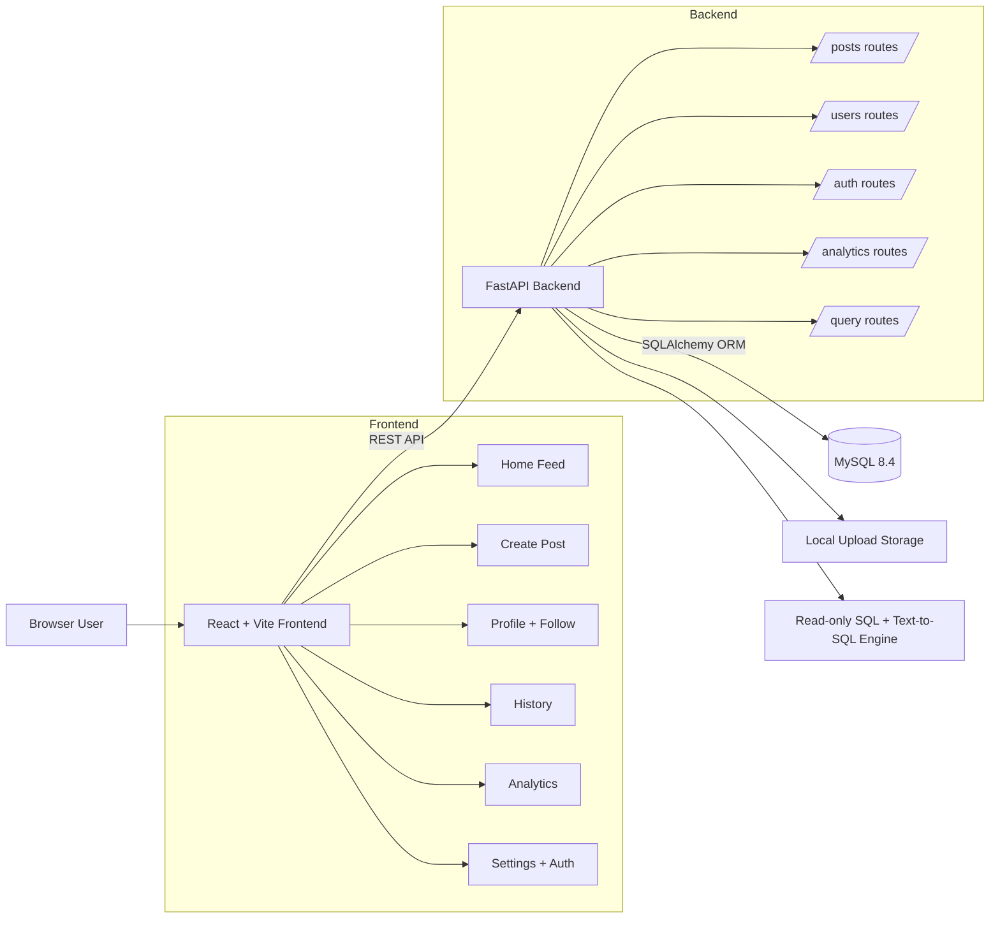
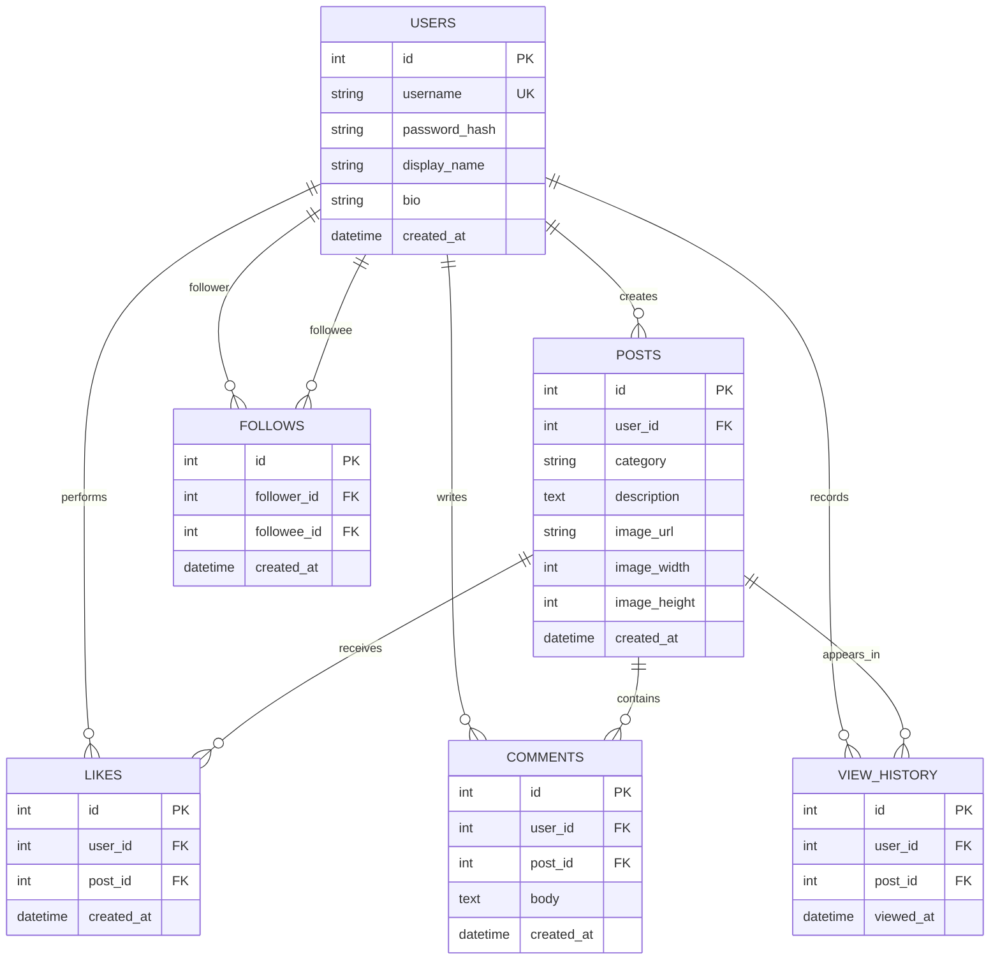
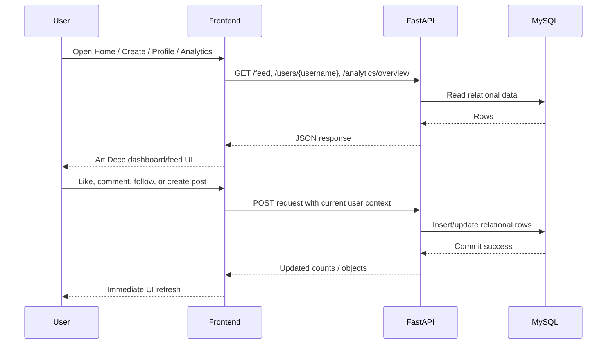

# HKUgram Project Diagrams

This file captures the diagrams that support the COMP3278 final presentation.
The diagrams are derived from the current implementation in `backend/app` and `frontend/src`.

## 1. System Architecture



## 2. ER Diagram



## 3. Main Data Flow



## 4. Query Feature Flow

```mermaid
flowchart TD
    Prompt[User prompt or SQL text] --> API[/query/text-to-sql or /query/sql]
    API --> Guard[Read-only validation]
    Guard --> Mapper[Prompt-to-SQL mapping]
    Mapper --> Exec[Execute SELECT only]
    Exec --> Result[Columns + rows + row_count]
    Result --> UI[Analytics / query demo view]
```

## Notes for Presentation

- The required relational design is covered by `users`, `posts`, `likes`, `comments`, `view_history`, and `follows`.
- The SQL system requirement is covered by the read-only `/query/sql` endpoint and the mapped `/query/text-to-sql` endpoint.
- The UI requirement is covered by the React frontend pages for feed, profile, history, analytics, and posting.
- The deployment requirement is covered by Docker Compose with separate frontend, backend, and MySQL services.
